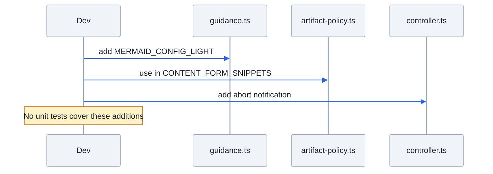
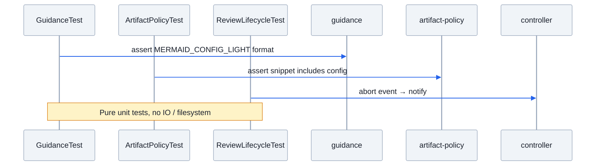

# 为上周改动补充单元测试

## Goal
为最近的 3 个改动（guidance.ts MERMAID_CONFIG_LIGHT 常量, artifact-policy.ts CONTENT_FORM_SNIPPETS 引用, controller.ts ESC abort notification）补充单元测试，确保新行为的正确性和可维护性。

## Current Flow
- `guidance.ts` 新增了 `MERMAID_CONFIG_LIGHT` 导出常量和 `MERMAID_CONFIG_EXAMPLE` 私有常量，更新了 `FLOW_TREE_GUIDANCE` 和 `BOUNDARIES_SEQUENCE_GUIDANCE` 的文本内容。
- `artifact-policy.ts` 的 `CONTENT_FORM_SNIPPETS` 中的 Current Flow、Desired Flow、Boundaries 的 Mermaid 代码块模板现在以 `MERMAID_CONFIG_LIGHT` 开头。
- `controller.ts` 的 `handleAgentEnd` 在纯 abort（无已批复执行可取消、无需重新审查）且有 UI 时调用 `ctx.ui.notify("Operation cancelled.", "info")`。
- 目前没有针对这些新增行为的测试。



## Desired Flow
- `guidance.test.ts`（新文件）测试：
  - `MERMAID_CONFIG_LIGHT` 的格式：以 `---` 开头和结尾，包含 `theme: base` 和 `themeVariables`
  - `MERMAID_CONFIG_LIGHT` 包含所有预期键（actorBkg, actorBorder, actorTextColor, actorLineColor, signalColor, signalTextColor, noteBkgColor, noteBorderColor, noteTextColor, labelBoxBkgColor, labelBoxBorderColor, labelTextColor）
  - `FLOW_TREE_GUIDANCE` 包含关于 Mermaid frontmatter config 的引导文本
  - `BOUNDARIES_SEQUENCE_GUIDANCE` 包含关于 frontmatter config 的引导文本
  - `IMPLEMENTATION_CALL_TREE_GUIDANCE` 不提及 frontmatter（它使用 ASCII tree）
- `artifact-policy.test.ts` 补充测试：
  - `CONTENT_FORM_SNIPPETS` 中的 Current Flow/Desired Flow/Boundaries 的 Mermaid 代码块应包含 `MERMAID_CONFIG_LIGHT`
  - snippet 生成的完整 mermaid 块应为 `` ```mermaid\n${MERMAID_CONFIG_LIGHT}\n...\n``` `` 的格式
- `review-lifecycle.test.ts` 补充测试：
  - 当没有已批复运行可取消、不需要重新审查、且 `ctx.hasUI` 为 true 时，`ctx.ui.notify("Operation cancelled.", "info")` 被调用
  - 当 `ctx.hasUI` 为 false 时，`ctx.ui.notify` 不被调用

## Boundaries
- 测试文件遵循既有约定：
  - `guidance.test.ts` 使用 `vitest` 的 `describe`/`it`/`expect`
  - 测试只测试公有 API（导出常量、函数行为），不测试私有实现细节
  - 使用纯函数式断言，不依赖文件系统（guidance 测试是纯常量验证）


  - artifact-policy 的 snippet 测试通过 `formatArtifactPolicyFailure` 间接验证 snippet 内容
  - Controller abort 通知测试利用现有的 `buildHarness`/`buildCtx`/`emitAbortedAgentEnd` 基础设施

## Implementation
写测试时按 Functional Core, Imperative Shell 原则：guidance 和 artifact-policy 的测试是纯函数（常量验证），controller 的测试需要模拟事件和上下文但只测试行为（notify 是否调用），不测试内部状态。

```text
planModeExtension()
  ├─ session_start → 注册 handlers
  └─ agent_end → handleAgentEnd()
       ├─ turnWasAborted()
       │    ├─ abortApprovedExecution() 成功 → 通知用户"已批复执行已取消"
       │    └─ 纯 abort（无已批复执行）
       │         ├─ ctx.hasUI==true  → ctx.ui.notify("Operation cancelled.", "info")  ← 新增
       │         └─ ctx.hasUI==false → 不通知
       ├─ hasPlanReviewObligation() && 无 todo → 提示需创建 TODO
       ├─ 有 latestArtifactPath → 校验 artifact policy
       │    ├─ 已批复且变更 → 提示重新审查
       │    └─ 未通过校验 → 提示修复格式
       └─ finishTurn()
```

### 1. 新建 `guidance.test.ts`

```ts
import { describe, expect, it } from "vitest";
import {
  MERMAID_CONFIG_LIGHT,
  FLOW_TREE_GUIDANCE,
  BOUNDARIES_SEQUENCE_GUIDANCE,
  IMPLEMENTATION_CALL_TREE_GUIDANCE,
} from "./guidance.ts";

const EXPECTED_THEME_KEYS = [
  "actorBkg", "actorBorder", "actorTextColor", "actorLineColor",
  "signalColor", "signalTextColor",
  "noteBkgColor", "noteBorderColor", "noteTextColor",
  "labelBoxBkgColor", "labelBoxBorderColor", "labelTextColor",
];

describe("MERMAID_CONFIG_LIGHT", () => {
  it("is a string", () => { expect(typeof MERMAID_CONFIG_LIGHT).toBe("string"); });
  it("starts with ---", () => { expect(MERMAID_CONFIG_LIGHT.startsWith("---")).toBe(true); });
  it("ends with ---", () => { expect(MERMAID_CONFIG_LIGHT.endsWith("---")).toBe(true); });
  it("contains theme: base", () => { expect(MERMAID_CONFIG_LIGHT).toContain("theme: base"); });
  it("contains themeVariables section", () => { expect(MERMAID_CONFIG_LIGHT).toContain("themeVariables:"); });
  it.each(EXPECTED_THEME_KEYS)("contains themeVariable key: %s", (key) => {
    expect(MERMAID_CONFIG_LIGHT).toContain(key);
  });
  it("produces valid frontmatter block separated by triple-dash lines", () => {
    const lines = MERMAID_CONFIG_LIGHT.split("\n");
    expect(lines[0]).toBe("---");
    expect(lines[lines.length - 1]).toBe("---");
    expect(lines[1]).toBe("config:");
  });
});

describe("FLOW_TREE_GUIDANCE", () => {
  it("includes frontmatter config guidance", () => {
    expect(FLOW_TREE_GUIDANCE.some(line => line.includes("frontmatter"))).toBe(true);
  });
  it("references the example format with ```mermaid", () => {
    expect(FLOW_TREE_GUIDANCE.join("\n")).toContain("```mermaid");
  });
});

describe("BOUNDARIES_SEQUENCE_GUIDANCE", () => {
  it("mentions frontmatter config requirement", () => {
    expect(BOUNDARIES_SEQUENCE_GUIDANCE).toContain("frontmatter");
  });
});

describe("IMPLEMENTATION_CALL_TREE_GUIDANCE", () => {
  it("does not mention mermaid frontmatter (ASCII tree only)", () => {
    expect(IMPLEMENTATION_CALL_TREE_GUIDANCE.join("\n")).not.toContain("frontmatter");
  });
});
```

### 2. 在 `artifact-policy.test.ts` 中追加

在 `plan artifact content forms` describe 块末尾追加 2 个测试：

```ts
it("includes MERMAID_CONFIG_LIGHT in Current Flow fix snippet", () => {
  const content = [
    "## Goal", "- goal.",
    "## Current Flow", "- prose only",
    "## Desired Flow", "- prose only",
    "## Boundaries", "- prose only",
    "## Implementation", "- prose only",
    "## Testing", "- testing.",
    "## Decisions", "- decisions.",
    "## Non-goals", "- non-goals.",
  ].join("\n");
  const result = validateArtifactPolicy({ path: planPath, content });
  const reason = formatArtifactPolicyFailure(planPath, result.issues);
  expect(reason).toContain("theme: base");
  expect(reason).toContain("actorBkg");
  expect(reason).toContain("---");
});
```

### 3. 在 `review-lifecycle.test.ts` 中追加

在 `requires review again after an aborted run even if it rewrites an approved artifact` 后面追加一个 describe 块：

```ts
describe("abort notification for plain ESC", () => {
  it("notifies user when ESC is pressed with no active approved run and hasUI is true", async () => {
    await withTempCtx(async (ctx) => {
      const harness = buildHarness();
      planModeExtension(harness.api as unknown as ExtensionAPI);
      await harness.emit("session_start", {}, ctx);
      // act mode, no approved run
      await harness.runCommand("plan-mode", "act", ctx);
      ctx.ui.notify.mockClear();

      await emitAbortedAgentEnd(harness, ctx);

      expect(ctx.ui.notify).toHaveBeenCalledWith("Operation cancelled.", "info");
    });
  });

  it("does not notify when hasUI is false", async () => {
    await withTempCtx(async (ctx) => {
      const noUiCtx = { ...ctx, hasUI: false };
      const harness = buildHarness();
      planModeExtension(harness.api as unknown as ExtensionAPI);
      await harness.emit("session_start", {}, noUiCtx);
      await harness.runCommand("plan-mode", "act", noUiCtx);

      await emitAbortedAgentEnd(harness, noUiCtx);

      expect(noUiCtx.ui.notify).not.toHaveBeenCalled();
    });
  });
});
```

## Testing
- `pnpm vitest run` 确保所有测试通过
- 新增测试覆盖增量代码行
- 不引入对文件系统或外部服务的依赖

## Decisions
- guidance 测试放在独立文件 `guidance.test.ts`，因为常量数量足够组合成一个 describe 块
- CONTENT_FORM_SNIPPETS 是私有常量，通过 `formatArtifactPolicyFailure` 间接测试（而不是直接 import 私有变量）
- controller abort 通知追加到 `review-lifecycle.test.ts`，复用已有的 `emitAbortedAgentEnd` 和测试基础设施

## Non-goals
- 不测试 `MERMAID_CONFIG_EXAMPLE`（私有常量，被 `FLOW_TREE_GUIDANCE` 间接验证覆盖）
- 不对 controller 进行完整的 `handleAgentEnd` 全覆盖测试（只测试新增的 abort 通知路径）
- 不改动已有测试通过情况
- 不添加集成测试
