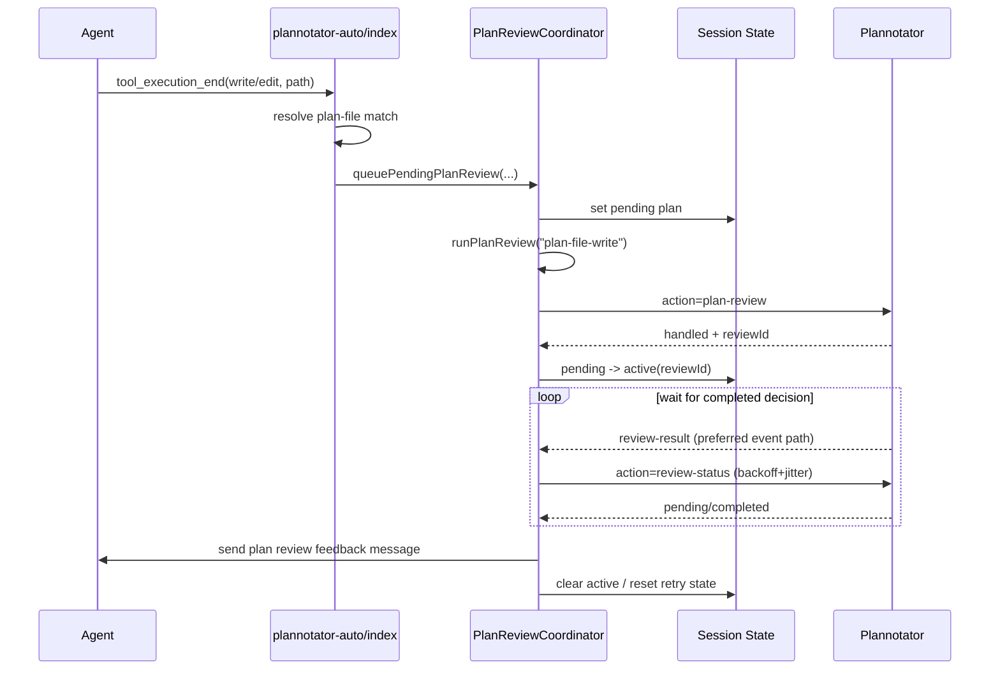

# Plannotator Auto

Automatically opens shared Plannotator review flows via event API for updated plan files and non-plan code changes.

## Configuration

By default, Plannotator Auto watches:

- generated plan files named `YYYY-MM-DD-<slug>.md` in `.pi/plans/<repo>/plan/`
- generated design specs named `YYYY-MM-DD-<slug>-design.md` in `.pi/plans/<repo>/specs/`

In worktree sessions without an explicit `planFile` override, it accepts two default directory aliases:

- `.pi/plans/<root-repo>/plan/`, where `<root-repo>` comes from the Git common-dir root
- `.pi/plans/<cwd-basename>/plan/`, where `<cwd-basename>` is the current worktree directory name

This keeps the primary repo behavior intact while also matching feature-workflow worktree plan directories. You can override the plan directory path (relative to the project root) in global settings `~/.pi/agent/third_extension_settings.json`.

Directory example:

```json
{
  "plannotatorAuto": {
    "planFile": ".pi/plans/my-repo/plan"
  }
}
```

`planFile` now only supports directories. Legacy single-file values (for example `.pi/PLAN.md`) are ignored. When `planFile` points at a plan directory like `.pi/plans/my-repo/plan`, Plannotator Auto also derives the sibling spec directory `.pi/plans/my-repo/specs` for spec-review auto-triggering.

Code-review auto-trigger is now **disabled by default**. To enable it globally:

```json
{
  "plannotatorAuto": {
    "codeReviewAutoTrigger": true
  }
}
```

To disable plan review in Plannotator Auto explicitly:

```json
{
  "plannotatorAuto": {
    "planFile": null
  }
}
```

## Behavior

- When the agent `write`/`edit` tool writes a `YYYY-MM-DD-*.md` file inside the configured plan directory, it queues plan-review work.
- When the agent `write`/`edit` tool writes a `YYYY-MM-DD-*-design.md` file inside the sibling `specs/` directory, it queues spec-review work.
- Without an explicit `planFile` override, default worktree sessions match either the root-repo or cwd-basename plan directory alias.
- The spec-review trigger uses the same default worktree alias logic and reuses the shared `plan-review` event action, but rewrites PI-facing completion text to `Spec Review`.
- If multiple plan writes happen before dispatch, only the latest pending plan file is kept.
- Plan review uses the shared Plannotator event channel:
  - start via `plannotator:request` with `action: "plan-review"`
  - completion via `plannotator:review-result`
  - fallback recovery via `action: "review-status"` polling
- For `plan-file-write` triggers, plan review can start even while agent is busy, and `tool_execution_end` now waits for the review decision before letting the run continue.
- Successful `write`/`edit` calls to **non-plan files** mark code-review as pending only when `codeReviewAutoTrigger` is enabled. On `agent_end`, if repo is dirty and UI is available, code-review (`action: "code-review"`) is requested.
- Async code-review completions now preserve inline `annotations`; if the reviewer returns annotations without top-level `feedback`, PI still receives a follow-up asking it to address the review comments.
- Code review now depends on explicit coordinator signal `isPlanReviewSettled(...)` rather than peeking internal plan-review maps.
- If Plannotator is unavailable on shared event channel, a warning is shown (no slash-command fallback).
- Keyboard shortcut `Ctrl+Alt+L` annotates the most recently modified generated review target across the configured/default `plan/` and sibling `specs/` directories (`YYYY-MM-DD-*.md` for plans, `YYYY-MM-DD-*-design.md` for specs) via shared event API (`action: "annotate"`), and now waits synchronously for the annotation result instead of using the short default request timeout.

## Architecture (Option B)

`plannotator-auto` now uses an explicit coordinator for plan-review lifecycle:

- `plan-review/coordinator.ts`
  - single owner of plan-review transitions and side effects
  - handles queue/start/status-poll/completion and sync-wait policy for `plan-file-write`
- `plan-review/state-store.ts`
  - state helpers (snapshot, pending replacement, stale cleanup)
- `plan-review/policy.ts`
  - pure policy decisions:
    - busy deferral policy
    - retry delay policy (exponential backoff + jitter + cap)
    - sync wait polling delay policy for active plan reviews
- `plan-review/types.ts`
  - shared state/context/type contracts
- `index.ts`
  - thin event adapter: classify incoming events and delegate to coordinator

## Plan-review sequence



## Logging

Debug logs go through the shared extension logger (default: `~/.pi/agent/pi-debug.log`).
Recommended filters:
- `ext:plannotator-auto`
- `reviewId`
- `sessionKey`
