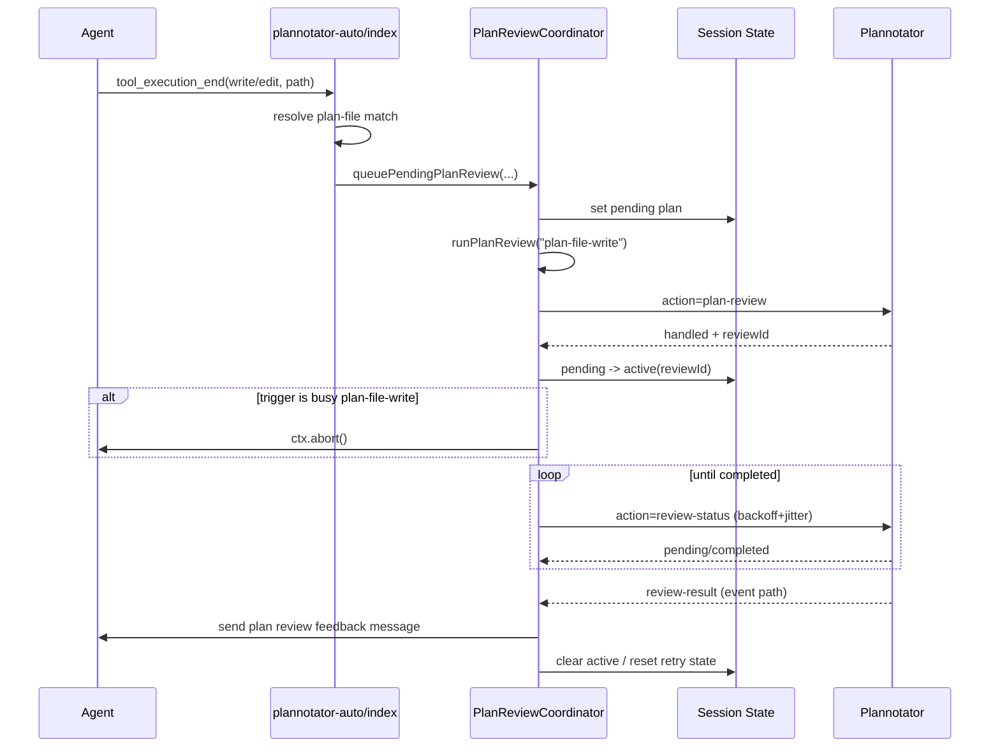

# Plannotator Auto

Automatically opens shared Plannotator review flows via event API for updated plan files and non-plan code changes.

## Configuration

By default, Plannotator Auto watches the plan directory `.pi/plans/<repo>/plan/` (repo slug = basename of the repo) and expects plan files named `YYYY-MM-DD-<slug>.md`. You can override the plan path (relative to the project root) in `~/.pi/agent/third_extension_settings.json`.

Directory example:

```json
{
  "plannotatorAuto": {
    "planFile": ".pi/plans/my-repo/plan"
  }
}
```

Single-file example:

```json
{
  "plannotatorAuto": {
    "planFile": ".pi/PLAN.md"
  }
}
```

To disable Plannotator Auto explicitly:

```json
{
  "plannotatorAuto": {
    "planFile": null
  }
}
```

## Behavior

- When the agent `write`/`edit` tool updates the configured plan file (file mode) **or** writes a `YYYY-MM-DD-*.md` file inside the configured plan directory (directory mode), it queues plan-review work.
- If multiple plan writes happen before dispatch, only the latest pending plan file is kept.
- Plan review is async and shared-channel based:
  - start via `plannotator:request` with `action: "plan-review"`
  - completion via `plannotator:review-result`
  - fallback recovery via `action: "review-status"` polling
- For `plan-file-write` triggers, plan review can start even while agent is busy.
- When plan review is accepted for a busy `plan-file-write` trigger, `ctx.abort()` is called to stop the in-flight run.
- Successful `write`/`edit` calls to **non-plan files** mark code-review as pending. On `agent_end`, if repo is dirty and UI is available, code-review (`action: "code-review"`) is requested.
- Code review now depends on explicit coordinator signal `isPlanReviewSettled(...)` rather than peeking internal plan-review maps.
- If Plannotator is unavailable on shared event channel, a warning is shown (no slash-command fallback).

## Architecture (Option B)

`plannotator-auto` now uses an explicit coordinator for plan-review lifecycle:

- `plan-review/coordinator.ts`
  - single owner of plan-review transitions and side effects
  - handles queue/start/status-poll/completion/abort policy
- `plan-review/state-store.ts`
  - state helpers (snapshot, pending replacement, stale cleanup)
- `plan-review/policy.ts`
  - pure policy decisions:
    - busy deferral policy
    - abort-after-start policy
    - retry delay policy (exponential backoff + jitter + cap)
- `plan-review/types.ts`
  - shared state/context/type contracts
- `index.ts`
  - thin event adapter: classify incoming events and delegate to coordinator

## Plan-review sequence



## Logging

Debug logs go through the shared extension logger (default: `~/.pi/agent/pi-debug.log`).
Recommended filters:
- `ext:plannotator-auto`
- `reviewId`
- `sessionKey`
