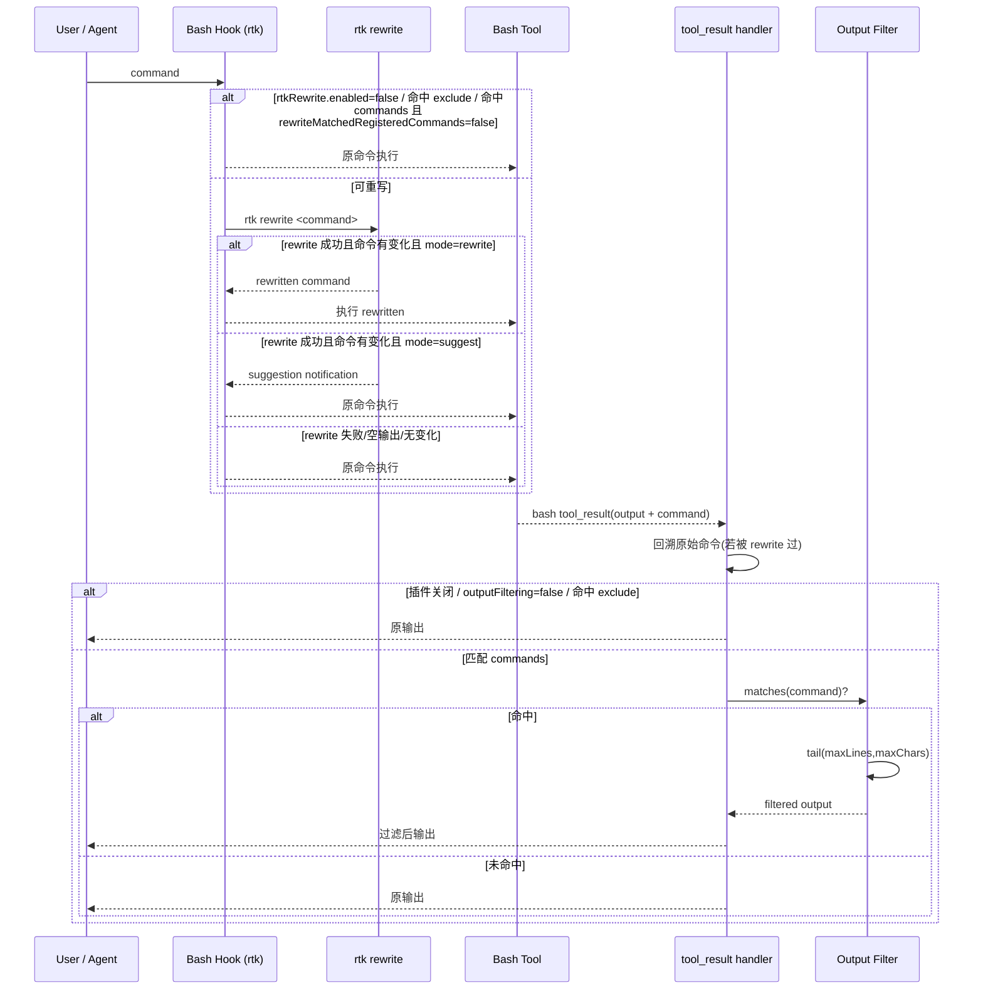

# RTK Rewrite Extension

RTK Rewrite 做两件事：

1. **命令重写（pre-exec）**：在 bash 命令执行前，调用 `rtk rewrite <command>` 自动改写命令。
2. **输出过滤（post-exec）**：在 bash 命令执行后，对**已注册命令**输出做 tail 聚合，减少噪音。

---

## 过滤逻辑总览

### A) 命令重写（执行前）

入口：`registerBashHook({ id: "rtk" })`

对每条 bash / user_bash 命令：

- 读取配置 `rtkRewrite.enabled`
- 按优先级决定是否跳过 rewrite：
  1. `enabled=false` → 跳过
  2. 命中 `exclude` 前缀 → 跳过
  3. 命中 `commands` 且 `rewriteMatchedRegisteredCommands=false` → 跳过
- 未跳过时调用 `rtk rewrite <command>`
- 当返回结果满足以下条件时才生效：
  - 退出码为 0
  - stdout 非空
  - 改写后命令 `rewritten !== command`
- 命中时根据 `rtkRewrite.mode` 决定行为：
  - `rewrite`：替换原命令；若 `notify=true` 且有 UI，弹出通知
  - `suggest`：只提示 rewritten command，不替换实际执行命令

### B) 输出过滤（执行后）

入口：`pi.on("tool_result")`（仅处理 bash tool result）

- 若插件关闭，或 `outputFiltering=false`，直接跳过
- 取本次执行命令；若这条命令之前被 rewrite 过，会回溯到 **原始命令** 再做匹配
- 原始命令命中 `exclude` 前缀则跳过
- 只处理文本类型输出
- 命中 `commands` 后执行 tail 截断（`maxLines` + `maxChars`）

### C) Tail 截断规则

对命中的输出执行：

1. 去掉末尾空行
2. 截取最后 `maxLines` 行（默认 30）
3. 若仍超过 `maxChars`（默认 4000）：
   - 输出 `...[truncated]\n` + 文本末尾字符

---

## 命令匹配来源（配置驱动）

匹配列表完全来自配置：

- 使用：`rtkRewrite.commands`

匹配方式：

- 子串匹配（大小写不敏感）

---

## Mermaid 时序图（rewrite + hook 过滤）



---

## 配置项

配置位置：

- 全局：`~/.pi/agent/third_extension_settings.json`
- 项目：`<repo>/.pi/third_extension_settings.json`

```json
{
  "rtkRewrite": {
    "enabled": true,
    "mode": "rewrite",
    "notify": true,
    "exclude": [],
    "outputFiltering": true,
    "rewriteMatchedRegisteredCommands": true,
    "commands": ["npm run build", "vitest", "cargo test"],
    "outputTailMaxLines": 30,
    "outputTailMaxChars": 4000
  }
}
```

### `exclude` 规则

`exclude` 是“前缀匹配”（忽略前导空格、大小写不敏感）：

- 完全等于前缀时排除
- 以前缀 + 空格 或 前缀 + Tab 开头时排除

例如 `exclude: ["git"]` 时：

- `git status` 排除
- `git\tstatus` 排除
- `gitx status` 不排除

---

## 插件命令

- `/rtk-rewrite-toggle`（单一开关命令；执行后会明确提示当前是 enabled 还是 disabled，并附带关键配置快照。消息过长时会自动截断并追加 `...`）
- `/rtk-rewrite-matched-command-rewrite-toggle`
- `/rtk-rewrite-mode <rewrite|suggest>`
- `/rtk-rewrite-commands <add|remove|clear|list> [pattern]`
- `/rtk-rewrite-exclude <prefix>`
- `/rtk-rewrite-include <prefix>`
- `/rtk-rewrite-status`

### `rtk-rewrite-commands` 示例

- 增加：`/rtk-rewrite-commands add turbo build`
- 删除：`/rtk-rewrite-commands remove vitest`
- 清空：`/rtk-rewrite-commands clear`
- 查看：`/rtk-rewrite-commands list`
