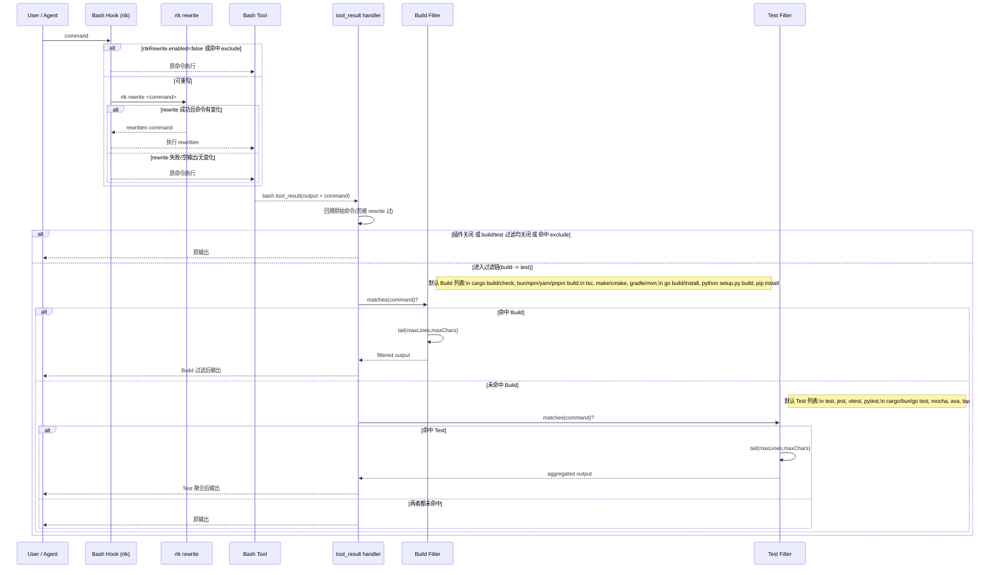

# RTK Rewrite Extension

RTK Rewrite 做两件事：

1. **命令重写（pre-exec）**：在 bash 命令执行前，调用 `rtk rewrite <command>` 自动改写命令。
2. **输出过滤（post-exec）**：在 bash 命令执行后，对 build/test 命令输出做 tail 聚合，减少噪音。

---

## 过滤逻辑总览

### A) 命令重写（执行前）

入口：`registerBashHook({ id: "rtk" })`

对每条 bash / user_bash 命令：

- 读取配置 `rtkRewrite.enabled`
- 命令命中 `exclude` 前缀则跳过
- 调用 `rtk rewrite <command>`
- 当返回结果满足以下条件时才生效：
  - 退出码为 0
  - stdout 非空
  - 改写后命令 `rewritten !== command`
- 命中时替换原命令；若 `notify=true` 且有 UI，弹出通知

### B) 输出过滤（执行后）

入口：`pi.on("tool_result")`（仅处理 bash tool result）

- 若插件关闭，或 `buildOutputFiltering=false` 且 `testOutputAggregation=false`，直接跳过
- 取本次执行命令；若这条命令之前被 rewrite 过，会回溯到 **原始命令** 再做匹配
- 原始命令命中 `exclude` 前缀则跳过
- 只处理文本类型输出
- 按顺序尝试过滤器：**build → test**
  - 第一个命中的过滤器生效（因此同时命中时，build 优先）

### C) Tail 截断规则（build/test 共用）

对命中的输出执行：

1. 去掉末尾空行
2. 截取最后 `maxLines` 行（默认 30）
3. 若仍超过 `maxChars`（默认 4000）：
   - 输出 `...[truncated]\n` + 文本末尾字符

---

## 哪些命令会被 hook 过滤（重点）

> 最终匹配列表 = 默认列表 + 配置中的额外列表（去重、trim、lowercase）。

### 默认 Build 命令（`buildOutputFiltering`）

以下任意子串（大小写不敏感）出现在命令中即命中：

- `cargo build`
- `cargo check`
- `bun build`
- `npm run build`
- `yarn build`
- `pnpm build`
- `tsc`
- `make`
- `cmake`
- `gradle`
- `mvn`
- `go build`
- `go install`
- `python setup.py build`
- `pip install`

匹配特点：**includes 子串匹配**。例如 `cargo build --release` 命中。

### 默认 Test 命令（`testOutputAggregation`）

按“词边界”匹配，避免误判（如 `latest` 不会误匹配 `test`）：

- `test`
- `jest`
- `vitest`
- `pytest`
- `cargo test`
- `bun test`
- `go test`
- `mocha`
- `ava`
- `tap`

匹配分隔符支持：空白、`|`、`;`、`&`。

### 自定义扩展

可通过配置追加命令关键字：

- `buildCommands`: 追加 build 关键字
- `testCommands`: 追加 test 关键字

示例：

```json
{
  "rtkRewrite": {
    "buildCommands": ["turbo build", "bazel build"],
    "testCommands": ["turbo test", "bazel test"]
  }
}
```

---

## Mermaid 时序图（rewrite + hook 过滤）



---

## 配置项

配置位置：

- 全局：`~/.pi/agent/third_extension_settings.json`
- 项目：`<repo>/.pi/third_extension_settings.json`

```json
{
  "rtkRewrite": {
    "enabled": true,
    "notify": true,
    "exclude": [],
    "buildOutputFiltering": true,
    "testOutputAggregation": true,
    "buildCommands": [],
    "testCommands": [],
    "outputTailMaxLines": 30,
    "outputTailMaxChars": 4000
  }
}
```

### `exclude` 规则

`exclude` 是“前缀匹配”（忽略前导空格、大小写不敏感）：

- 完全等于前缀时排除
- 以前缀 + 空格 或 前缀 + Tab 开头时排除

例如 `exclude: ["git"]` 时：

- `git status` 排除
- `git\tstatus` 排除
- `gitx status` 不排除

---

## 插件命令

- `/rtk-rewrite-enable`
- `/rtk-rewrite-disable`
- `/rtk-rewrite-toggle`
- `/rtk-rewrite-exclude <prefix>`
- `/rtk-rewrite-include <prefix>`
- `/rtk-rewrite-status`
