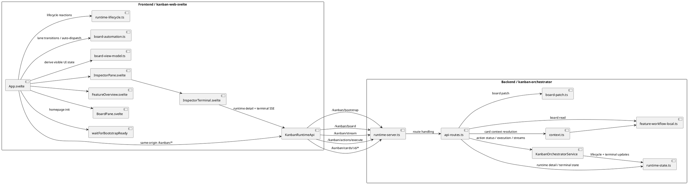

# kanban-web-svelte

A Svelte-based Kanban web UI module for the embedded `kanban-orchestrator` runtime in `pi-kit`.

## C2 runtime model

The UI now uses a bootstrap + same-origin proxy model:

1. `POST /kanban/bootstrap`
2. `GET /kanban/board`
3. `GET /kanban/stream`
4. `POST /kanban/actions/execute`
5. `GET /kanban/cards/:id/context`
6. `GET /kanban/cards/:id/runtime`

The browser no longer manages runtime `baseUrl` or `token` through the UI.
Those details stay behind the backend boundary.

## Responsibility diagram



## Local development

### 1. Start the embedded runtime

Inside your target repo session:

```text
/kanban-runtime-start --port 17888
```

### 2. Run the Svelte app

```bash
cd kanban-web-svelte
npm install
npm run dev
```

Default dev URL: `http://localhost:4174`

### 3. Dev proxy

The Vite dev server proxies same-origin `/kanban/*` requests to:

- `KANBAN_PROXY_TARGET`
- default: `http://127.0.0.1:17888`

Example:

```bash
KANBAN_PROXY_TARGET=http://127.0.0.1:17888 npm run dev
```

## Build

```bash
npm run build
npm run preview
```

## Current UI behavior

- Homepage bootstraps automatically via `POST /kanban/bootstrap`
- Board loads automatically after bootstrap succeeds
- Stream connection stays in the background
- Users see product-level states such as preparing, degraded sync, or fatal bootstrap failure
- Action execution sends business intent only; backend derives runtime execution details
