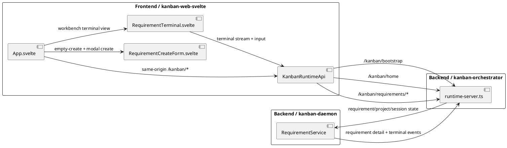

# kanban-web-svelte

A Svelte-based Kanban web UI module for the embedded `kanban-orchestrator` runtime in `pi-kit`.

## Runtime model

The UI now uses a bootstrap + same-origin proxy model, but the product flow has been rebuilt around **projects + requirements + sessions**.

Current primary endpoints:

1. `POST /kanban/bootstrap`
2. `GET /kanban/home`
3. `POST /kanban/requirements`
4. `GET /kanban/requirements/:id`
5. `POST /kanban/requirements/:id/start`
6. `POST /kanban/requirements/:id/restart`
7. `POST /kanban/requirements/:id/board-status`
8. `GET /kanban/requirements/:id/terminal/stream`
9. `POST /kanban/requirements/:id/terminal/input`

The browser no longer manages runtime `baseUrl` or `token` through the UI.
Those details stay behind the backend boundary.

## Responsibility diagram



## 启动与本地验证

### 1. 启动 daemon runtime

在目标 repo 的 pi session 里运行：

```text
/kanban-runtime-start --port 17888
```

预期：runtime 启动后，对外提供 `/kanban/*` 接口。

### 2. 启动前端

```bash
cd kanban-web-svelte
npm install
npm run dev
```

默认地址：

```text
http://127.0.0.1:4174
```

### 3. 前端代理到 daemon

Vite dev server 会把同源 `/kanban/*` 请求代理到：

- `KANBAN_PROXY_TARGET`
- 默认值：`http://127.0.0.1:17888`

如果 runtime 不在默认端口，可以显式指定：

```bash
KANBAN_PROXY_TARGET=http://127.0.0.1:17888 npm run dev
```

### 4. 打开页面验证

浏览器打开：

```text
http://127.0.0.1:4174
```

然后按下面流程验收：

#### 场景 A：没有未完成 requirement

1. 首页应直接进入创建表单
2. 填写：
   - Requirement name
   - Prompt
   - Project name / Project path
3. 提交后应直接进入 requirement 全屏工作台

#### 场景 B：有未完成 requirement

1. 首页应显示按项目分组的：
   - `Inbox`
   - `In Progress`
   - `Done`
2. 这 3 组都应可以折叠
3. 点击任意 requirement 应进入全屏工作台

### 5. 验证真实 PTY 启动与 terminal 交互

在工作台里：

1. 默认会看到可编辑的 **Start command**，通常是 `pi "<prompt>"`
2. 点击 **Start session**
3. 启动后，右侧 wterm 应显示真实 shell 输出
4. shell 会自动执行 `pi "<prompt>"`
5. 继续直接在 wterm 中输入，验证 `/kanban/requirements/:id/terminal/input` 会把原始键盘输入透传给 PTY
6. 如果 `pi` 退出，shell 仍应保留；点击 **Restart session** 可重开一个新的 shell

### 6. 验证看板状态流转

在工作台里继续操作：

1. 点击 **Mark in progress** / **Mark done** / **Move to inbox**
2. 返回首页后确认 requirement 在对应分组中正确移动
3. 确认看板状态变化不依赖 terminal 是否仍然存活

### 7. 快捷键验证

任意页面按：

```text
Ctrl + Shift + T
```

预期：

- 打开创建弹框
- 默认项目优先取最近一次进入详情页的项目
- 仍然允许切换历史项目或手填 path

## Build

```bash
npm run build
npm run preview
```

## Current UI behavior

- Homepage bootstraps automatically via `POST /kanban/bootstrap`
- If there are **no unfinished requirements**, homepage opens the create flow directly
- If there **are unfinished requirements**, homepage shows project-grouped `Inbox / In Progress / Done`
- All 3 groups are collapsible
- Clicking a requirement opens a full-screen workbench
- Clicking **Start session** creates a real PTY-backed shell in the requirement project and streams it into wterm
- Keyboard input goes directly through `@wterm` to `/kanban/requirements/:id/terminal/input`
- `Ctrl + Shift + T` opens the create modal from anywhere
