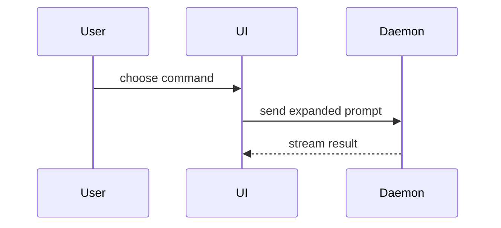

> **参考 / Reference**: 本 prompt 改编自 HumanLayer 的 `show-me` skill — https://github.com/humanlayer/skills (`plugins/show-me/skills/show-me/SKILL.md`)。内容形状(pseudocode、call tree、component tree、file tree、Mermaid、diff)与上游保持一致;本仓库的差异化修改为:必须写入 HTML 文件(见下)与 `.pi/html/pi-kit/` 路径约定。

Explain ${@:-the current topic of conversation} visually. Skip the preamble and keep prose brief. Pick the smallest view that makes the key point clear.

**必须写入 HTML 文件(mandatory)**: The visual explanation must always be written into one self-contained HTML file — a diagram, an infographic, or a short slide deck, whichever fits the point. Inline code blocks or Mermaid in chat are not the deliverable; the HTML file is. Follow this repo's HTML artifact convention: write the file under `.pi/html/pi-kit/` with the filename `YYYY-MM-DD-show-me-{description}.html` (use today's date; derive `{description}` from the topic when one was given). Match the product's colors, type, spacing, and components; use real labels and data; support desktop and mobile.

Do not run `open` and do not auto-open the file — just report the written path in chat.

The shapes below are content to render inside the HTML file, each placed next to the short text it supports:

- Show logic or an algorithm as pseudocode:

```text
on(save)
  if content is unchanged
    return cached result
  write new content
  return fresh result
```

- Show runtime control flow as a call tree:

```text
submitForm
  createSession
    persistPrompt
    launchAgent
  navigateToSession
```

- Show UI structure as a component tree, including state and module boundaries that matter:

```tsx
<SessionPage> (apps/example/src/routes/session.tsx)
  useSessionEvents()
  <SessionToolbar>
    <RunSkillButton> (packages/ui)
```

- Show file responsibility or a broad refactor as a shallow file tree:

```text
src/
├── commands/       # parses user actions
├── sessions/       # owns session state
└── transport/      # sends API requests
```

- Show component interaction, control flow, or data flow with Mermaid:



- Use `diff` when the point is what changes and the surrounding shape already exists. Match the diff shape to the topic.

For a component change:

```diff
 <SessionPage>
   useSessionEvents()
   <SessionToolbar>
+    <RunSkillButton />
   <SessionTimeline>
+    <SkillResultCard />
```

For a file-layout change:

```diff
 src/
 ├── commands/
+│   └── show-me.ts       # expands the slash command
 ├── sessions/
-└── transport.ts
+└── transport/
+    ├── client.ts
+    └── stream.ts
```

For a call-tree or call-stack change:

```diff
 submitForm
   createSession
     persistPrompt
+    expandSkillMention
     launchAgent
-  navigateToSession
+  navigateToSession
+    subscribeToEvents
```

For a state or control-flow change:

```diff
 on(save)
-  write content
+  if content is unchanged
+    return cached result
+  write new content
+  invalidate cache
```

- Show the whole block when most of it is new, when omitted context would hide ownership or order, or when the user needs a copyable target shape:

```ts
function expandSkill(command: string): string {
  const skillName = command.slice(1)
  return `use the ${skillName} skill`
}
```

- For a visual UI, layout, state comparison, or concept too dense for Mermaid, render it inside the HTML file (see the mandatory rule above) — a diagram, an infographic, or a short slide deck, whichever fits the point.

- Keep only the calls, files, props, states, and boundaries needed to answer the user's current question.

You may use one of these, you may use several, it is unlikely you will use all of them. Use your judgement and don't overwhelm the user.
