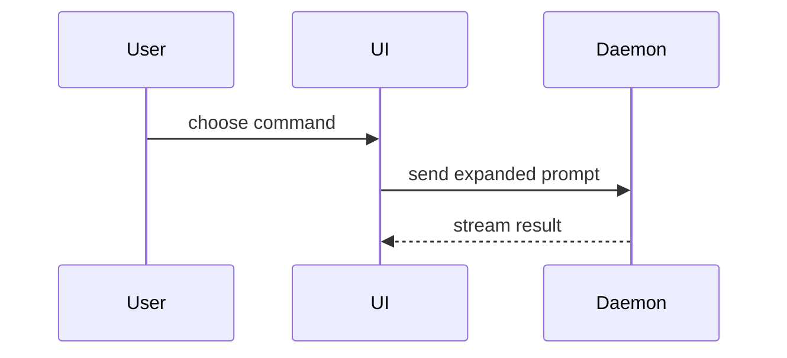
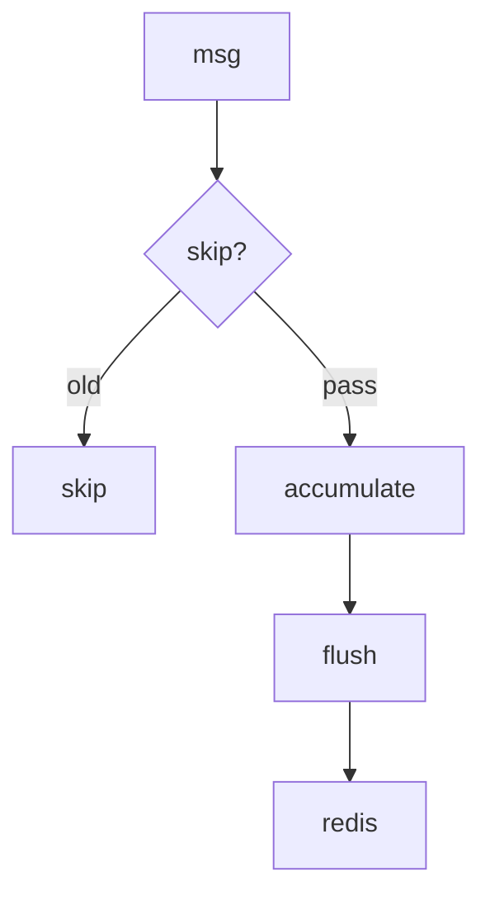

> **参考 / Reference**: 本 prompt 改编自 HumanLayer 的 `show-me` skill — https://github.com/humanlayer/skills (`plugins/show-me/skills/show-me/SKILL.md`)。内容形状(pseudocode、call tree、component tree、file tree、Mermaid、diff)与上游保持一致。

Explain ${@:-the current topic of conversation} visually. Skip the preamble and keep prose brief. Pick the smallest view that makes the key point clear.

The shapes below are content to render in chat, each placed next to the short text it supports:

- Show logic or an algorithm as pseudocode:

```text
on(save)
  if content is unchanged
    return cached result
  write new content
  return fresh result
```

- Show runtime control flow as a call tree:

```text
submitForm
  createSession
    persistPrompt
    launchAgent
  navigateToSession
```

- Show UI structure as a component tree, including state and module boundaries that matter:

```tsx
<SessionPage> (apps/example/src/routes/session.tsx)
  useSessionEvents()
  <SessionToolbar>
    <RunSkillButton> (packages/ui)
```

- Show file responsibility or a broad refactor as a shallow file tree:

```text
src/
├── commands/       # parses user actions
├── sessions/       # owns session state
└── transport/      # sends API requests
```

- Show component interaction, control flow, or data flow with Mermaid:



Compose Mermaid so it renders as terminal art inside the chat pane. The diagram must fit the terminal width — wider diagrams silently fall back to the raw code block:

- Prefer `flowchart TB` over `flowchart LR`. A long chain of nodes in `LR` explodes horizontally: 8 chained nodes can reach ~285 columns, far beyond a typical fullscreen terminal (~180–240 columns).
- Keep node labels short. Wrap long text with `<br/>` instead of one long line, and keep branch labels terse.
- Keep the whole diagram under ~100 columns wide. If a graph needs more than ~8 nodes, split it into two or three smaller diagrams.
- Use `sequenceDiagram` for linear request/response flows, and `flowchart TB` for pipelines and data flow.
- Show only the nodes and edges needed for the point — omit ownership details, file paths, and code snippets inside node labels.

For a pipeline, prefer this shape:



- Use `diff` when the point is what changes and the surrounding shape already exists. Match the diff shape to the topic.

For a component change:

```diff
 <SessionPage>
   useSessionEvents()
   <SessionToolbar>
+    <RunSkillButton />
   <SessionTimeline>
+    <SkillResultCard />
```

For a file-layout change:

```diff
 src/
 ├── commands/
+│   └── show-me.ts       # expands the slash command
 ├── sessions/
-└── transport.ts
+└── transport/
+    ├── client.ts
+    └── stream.ts
```

For a call-tree or call-stack change:

```diff
 submitForm
   createSession
     persistPrompt
+    expandSkillMention
     launchAgent
-  navigateToSession
+  navigateToSession
+    subscribeToEvents
```

For a state or control-flow change:

```diff
 on(save)
-  write content
+  if content is unchanged
+    return cached result
+  write new content
+  invalidate cache
```

- Show the whole block when most of it is new, when omitted context would hide ownership or order, or when the user needs a copyable target shape:

```ts
function expandSkill(command: string): string {
  const skillName = command.slice(1)
  return `use the ${skillName} skill`
}
```

- Keep only the calls, files, props, states, and boundaries needed to answer the user's current question.

You may use one of these, you may use several, it is unlikely you will use all of them. Use your judgement and don't overwhelm the user.
