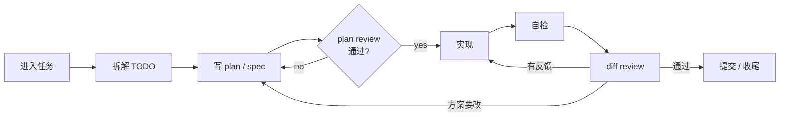
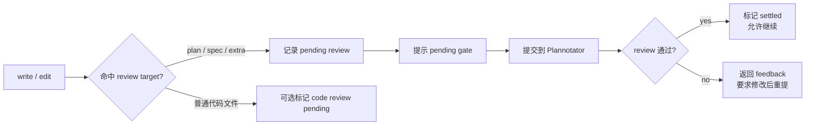

<!-- 使用：npx slidev slides/pi-agent-pi-kit.md -->

# pi agent 与 pi-kit

<div class="big-claim mt-6">
把一个轻量 agent 底座，变成自己的工程工作流。
</div>

<div v-click class="mt-8 text-lg subtle leading-relaxed">
今天重点不讲“pi 有多少功能”，而是讲：为什么我会围绕 pi 维护一套个人 pi-kit。
</div>

---
layout: default
class: agenda-slide
---

# 今天只讲 4 件事

<div class="mt-8 agenda-grid">
  <div class="split-card agenda-card">
    <span class="tag">01</span>
    <h3 class="mt-4">为什么看 pi</h3>
    <p>它不是大而全 agent，而是能被编排的终端底座。</p>
  </div>
  <div class="split-card agenda-card">
    <span class="tag">02</span>
    <h3 class="mt-4">我的工作流闭环</h3>
    <p>从进入任务到 review 收尾，让 agent 跟着工程节奏走。</p>
  </div>
  <div class="split-card agenda-card">
    <span class="tag">03</span>
    <h3 class="mt-4">pi-kit 积木</h3>
    <p>按问题组织插件，而不是按插件名背清单。</p>
  </div>
  <div class="split-card agenda-card">
    <span class="tag">04</span>
    <h3 class="mt-4">如何开始</h3>
    <p>给一个最小试用路径，避免一上来就搬完整配置。</p>
  </div>
</div>

---
layout: default
---

# pi code agent：一句话

<div class="claim-box mt-8 text-xl leading-relaxed">
<strong>pi code agent</strong> 是一个开源的 <strong>minimal terminal coding harness</strong>。
核心很小，重点是把运行形态、上下文和扩展点留给你组合。
</div>

<div class="mt-7 two-grid">
  <div v-click class="split-card">
    <h3>我关心的能力</h3>
    <ul class="mt-3">
      <li>终端优先，适合真实开发现场</li>
      <li>interactive / JSON / RPC / SDK 多种运行形态</li>
      <li>session、tree、fork、compact 这些上下文能力扎实</li>
    </ul>
  </div>
  <div v-click class="split-card">
    <h3>入口</h3>
    <ul class="mt-3">
      <li>GitHub：<a href="https://github.com/badlogic/pi-mono" target="_blank">github.com/badlogic/pi-mono</a></li>
      <li>目录：`packages/coding-agent`</li>
      <li>官网：<a href="https://pi.dev" target="_blank">pi.dev</a></li>
    </ul>
  </div>
</div>

---
layout: default
---

# `/tree` 展示的是 Session Tree

<div class="tree-explain-grid mt-5">
  <div class="tree-screen">
    <div class="tree-screen-title">Session Tree</div>
    <div class="tree-help">↑/↓ move · ←/→ page · Type to search · shift+t: label time</div>
    <div class="tree-log">
      <div><span class="role assistant">assistant</span> 好，继续最后一节设计...</div>
      <div><span class="role user">user</span> 先工作目录切换到 pi-kit，然后开始实施</div>
      <div><span class="role tool">read</span> .pi/plans/pi-kit/specs/2026-04-23-remote-approval-design.md</div>
      <div><span class="role tool">write</span> .pi/plans/pi-kit/plan/2026-04-23-implement-remote-approval.md</div>
      <div><span class="role assistant">assistant</span> 已切到 worktree，设计已落成 spec，并做了自检</div>
      <div class="branch">+- [branch summary] remote approval implementation is in progress</div>
      <div class="branch">|  +- [pi_context] previous branch context injected above</div>
      <div class="branch">|  `- [context_checkout] target=pi-remote-approval-migration</div>
      <div><span class="role assistant">assistant</span> (aborted)</div>
      <div><span class="role tool">bash</span> git branch --show-current</div>
    </div>
  </div>

  <div class="tree-side-notes">
    <div v-click class="flow-note">
      <strong>不是文件树</strong>
      <span>它展示的是一次 session 里的消息、工具调用、上下文标签和分支。</span>
    </div>
    <div v-click class="flow-note">
      <strong>能看到“走到哪了”</strong>
      <span>长任务里先定位当前节点，再决定继续、回退或切分支。</span>
    </div>
    <div v-click class="flow-note">
      <strong>能解释 fork / compact</strong>
      <span>Tree 让上下文分支变成可见结构，而不是散在聊天记录里。</span>
    </div>
  </div>
</div>

<div v-click class="tree-bottom-line mt-4">
一句话：`/tree` 是 agent 工作流里的“上下文地图”。
</div>

---
layout: default
---

# 我为什么注意到 pi

<div class="mt-6 two-grid">
  <div v-click class="split-card">
    <span class="tag">很多 agent 的方向</span>
    <h3 class="mt-4">功能更满</h3>
    <ul>
      <li>更多内建流程</li>
      <li>更多默认工具</li>
      <li>更多一站式体验</li>
    </ul>
  </div>
  <div v-click class="split-card">
    <span class="tag">我想要的方向</span>
    <h3 class="mt-4">底座更稳</h3>
    <ul>
      <li>不强行规定工作方式</li>
      <li>扩展点清楚</li>
      <li>能长期承载个人定制</li>
    </ul>
  </div>
</div>

<div v-click class="mt-8 big-claim">
对我来说，pi 的定位是：<span class="accent-blue">可编排的 agent 底座</span>。
</div>

---
layout: default
---

# pi 真正值得看的地方

<div class="paired-grid mt-6">
  <div v-click class="split-card">
    <h3>它把底座能力做小</h3>
    <ul class="mt-3">
      <li>运行形态：interactive / print / JSON / RPC / SDK</li>
      <li>上下文：session、`/tree`、fork、compact</li>
      <li>终端交互：文件引用、bash、快捷键、消息队列</li>
    </ul>
  </div>

  <div v-click class="split-card">
    <h3>它把工作流留给扩展</h3>
    <ul class="mt-3">
      <li>注册 Tool / Command / Shortcut</li>
      <li>注册 UI / status / widget / overlay / renderer</li>
      <li>挂生命周期：从 `input` 到 `tool_call`，再到 `session_before_*`</li>
    </ul>
  </div>

  <div v-click class="flow-note">
    这些能力不是最终体验，而是让 agent 可被工程化编排的基础。
  </div>

  <div v-click class="flow-note">
    关键点：不改内核，也能把 plan、review、todo、权限门禁、状态提示做成原生体验。
  </div>
</div>

<div class="mt-4 subtle text-sm">
参考：<a href="https://github.com/badlogic/pi-mono/blob/main/packages/coding-agent/docs/extensions.md" target="_blank">pi coding-agent extensions.md</a>
</div>

---
layout: default
---

# pi agent hook 点：四层扩展面

<div class="hook-surface-grid mt-6">
  <div v-click class="plugin-card compact-card">
    <span class="tag">入口层</span>
    <h3 class="mt-3">输入和命令</h3>
    <p>`registerCommand`、`registerShortcut`、`input`：先截住用户意图，再决定是自己处理，还是交给 agent。</p>
  </div>
  <div v-click class="plugin-card compact-card">
    <span class="tag">上下文层</span>
    <h3 class="mt-3">提示词和消息</h3>
    <p>`before_agent_start`、`context`：给系统提示词加规则，或在发给模型前改写 message 列表。</p>
  </div>
  <div v-click class="plugin-card compact-card">
    <span class="tag">执行层</span>
    <h3 class="mt-3">工具调用和结果</h3>
    <p>`tool_call`、`tool_result`：拦截 bash / write / read，做权限确认、路径保护、结果裁剪。</p>
  </div>
  <div v-click class="plugin-card compact-card">
    <span class="tag">会话层</span>
    <h3 class="mt-3">session 生命周期</h3>
    <p>`session_before_fork`、`session_before_compact`、`session_before_tree`：控制分支、压缩、恢复这些上下文动作。</p>
  </div>
</div>

<div v-click class="mt-6 flow-note text-lg">
我理解 pi 的设计味道：核心只负责把事件暴露出来，真正的工作流策略交给 extension。
</div>

<div class="source-link">
Source: <a href="https://github.com/badlogic/pi-mono/blob/main/packages/coding-agent/docs/extensions.md" target="_blank">pi coding-agent extensions.md</a>
</div>

---
layout: default
---

# 一次请求会经过哪些 hook

<div class="hook-flow mt-6">
  <div v-click>
    <span>01</span>
    <strong>用户输入</strong>
    <code>input</code>
    <p>改写、补上下文，或者直接处理。</p>
  </div>
  <div v-click>
    <span>02</span>
    <strong>Agent 启动前</strong>
    <code>before_agent_start</code>
    <p>注入规则，调整 system prompt。</p>
  </div>
  <div v-click>
    <span>03</span>
    <strong>每个模型 turn</strong>
    <code>turn_start / context</code>
    <p>准备发给 provider 的消息。</p>
  </div>
  <div v-click>
    <span>04</span>
    <strong>Provider 边界</strong>
    <code>before_provider_request</code>
    <p>检查或替换请求 payload。</p>
  </div>
  <div v-click>
    <span>05</span>
    <strong>工具执行</strong>
    <code>tool_call / tool_result</code>
    <p>阻止危险动作，修改工具结果。</p>
  </div>
  <div v-click>
    <span>06</span>
    <strong>收尾</strong>
    <code>turn_end / agent_end</code>
    <p>记录状态，触发 review 或下一步。</p>
  </div>
</div>

<div v-click class="mt-5 claim-box text-lg">
这条链路的价值：不是“多几个插件点”，而是能把工程纪律挂在 agent 的真实执行路径上。
</div>

<div class="source-link">
Source: <a href="https://github.com/badlogic/pi-mono/blob/main/packages/coding-agent/docs/extensions.md" target="_blank">pi coding-agent extensions.md</a>
</div>

---
layout: default
---

# hook 点能落到哪些工程动作

<div class="hook-case-grid mt-6">
  <div v-click class="split-card">
    <h3>权限门禁</h3>
    <p>`tool_call` 里拦截 `bash`、`write`，遇到危险命令、敏感路径时用 `ctx.ui.confirm()` 问人。</p>
  </div>
  <div v-click class="split-card">
    <h3>计划和审查</h3>
    <p>`input` / `before_agent_start` 把 plan-first、review-first 变成默认流程，而不是靠人每次提醒。</p>
  </div>
  <div v-click class="split-card">
    <h3>上下文治理</h3>
    <p>`session_before_compact` 自定义压缩，`session_before_tree` 定制 tree，`appendEntry` 持久化状态。</p>
  </div>
  <div v-click class="split-card">
    <h3>原生交互体验</h3>
    <p>`ctx.ui`、status、widget、overlay、custom renderer 把 todo、状态、选择器直接放进 TUI。</p>
  </div>
</div>

<div v-click class="mt-6 big-claim">
所以 pi-kit 的很多能力，本质上是在这些 hook 上<span class="accent-green">挂工程约束</span>。
</div>

<div class="source-link">
Source: <a href="https://github.com/badlogic/pi-mono/blob/main/packages/coding-agent/docs/extensions.md" target="_blank">pi coding-agent extensions.md</a>
</div>

---
layout: default
---

# pi-kit 不是发行版，是工作流系统

<div class="mt-8 big-claim">
pi 解决的是：<span class="accent-blue">agent 怎么跑</span>
</div>

<div v-click class="mt-6 big-claim">
pi-kit 解决的是：<span class="accent-green">工程师怎么持续使用它</span>
</div>

<div v-click class="mt-8 claim-box text-lg leading-relaxed">
所以我维护的 pi-kit，不追求覆盖所有场景。它只服务一个目标：
把我每天写代码、切任务、做计划、过 review 的节奏装进 agent。
</div>

---
layout: default
---

# 我的日常闭环



<div class="mt-5 three-grid">
  <div v-click class="plugin-card">
    <h3>前半段：防止方向跑偏</h3>
    <p>feature 进入上下文，todo 拆清下一步，plan/spec 先固定方案，没过 review 就回去改。</p>
  </div>
  <div v-click class="plugin-card">
    <h3>中间段：循环收敛</h3>
    <p>实现、自检、diff review 不是一次性流水线；review 反馈会回到实现，必要时回到 plan。</p>
  </div>
  <div v-click class="plugin-card">
    <h3>后半段：形成审查闭环</h3>
    <p>计划先审，代码再审，评论处理到 resolve，不把半成品带走。</p>
  </div>
</div>

---
layout: default
---

# 01 · feature-workflow：进入任务

<div class="mt-2 subtle">先解决多任务并行时最容易乱的地方：分支、worktree、上下文恢复。</div>

<div class="mt-6 two-grid">
  <div v-click class="split-card">
    <h3>痛点</h3>
    <ul>
      <li>新需求要建分支、切目录、恢复上下文</li>
      <li>多个 feature 并行时容易串线</li>
      <li>合并后的 worktree 容易堆积</li>
    </ul>
  </div>
  <div v-click class="split-card">
    <h3>结果</h3>
    <ul>
      <li>以 feature 管理工作树</li>
      <li>切换任务时直接回到目标目录</li>
      <li>用 validate / prune 降低脏状态</li>
    </ul>
  </div>
</div>

<div v-click class="mt-5 code-commands">

```bash
/feature-setup
/feature-start
/feature-switch <branch>
/feature-validate
/feature-prune-merged
```

</div>

---
layout: default
---

# 02 · todo-workflow：驱动下一步

<div class="mt-2 subtle">TODO 不只是记录列表，而是 agent 当前焦点的外部化。</div>

<div class="mt-6 two-grid">
  <div v-click class="split-card">
    <h3>机制</h3>
    <ul>
      <li>TODO 绑定 repo / session</li>
      <li>可以关联 feature 分支</li>
      <li>`doing` 直接反映当前焦点</li>
    </ul>
  </div>
  <div v-click class="split-card">
    <h3>适合场景</h3>
    <ul>
      <li>一个 feature 拆成多步</li>
      <li>经常中断再恢复</li>
      <li>希望 agent 自己接上下一步</li>
    </ul>
  </div>
</div>

<div v-click class="mt-5 code-commands">

```bash
/todo add <description>
/todo start <id>
/todo resume <id>
/todo finish <id>
/todo list
```

</div>

---
layout: default
---

# 03 · 审查闭环：先 plan，再 diff

<div class="mt-6 two-grid">
  <div v-click class="plugin-card">
    <span class="tag">plannotator-auto</span>
    <h3 class="mt-4">防止刚写完计划就开干</h3>
    <p>plan / spec 写完先审，有 pending review 就先处理。它把“想清楚再实现”变成流程约束。</p>
  </div>
  <div v-click class="plugin-card">
    <span class="tag">diffx-review</span>
    <h3 class="mt-4">让 review 对准本次改动</h3>
    <p>只看明确 diff，comment / reply / resolve 成闭环，更接近真实 PR review。</p>
  </div>
</div>

<div v-click class="mt-6 code-commands">

```bash
/diffx-start-review -- --cached
/diffx-process-review
```

</div>

<div v-click class="mt-5 claim-box">
效果很直接：计划质量和代码质量都在同一个 agent 上下文里被拉住。
</div>

---
layout: default
---

# 03.1 · plannotator-auto：把“先审计划”变成默认动作

<div class="claim-box mt-5 text-lg leading-relaxed">
它不是一个新的 plan 命令，而是一个 <strong>监听写文件事件的流程守门员</strong>：
当 agent 写出 plan / spec 后，先把这个文件送进 Plannotator 审查，再允许工作继续往实现推进。
</div>

<div class="mt-5 three-grid">
  <div v-click class="plugin-card compact-card">
    <span class="tag">看什么</span>
    <h3 class="mt-3">计划与规格文档</h3>
    <p>默认看 `.pi/plans/&lt;repo&gt;/plan/` 和 sibling `specs/`，也支持额外目标目录。</p>
  </div>
  <div v-click class="plugin-card compact-card">
    <span class="tag">拦什么</span>
    <h3 class="mt-3">未提交的 review</h3>
    <p>检测到 pending review 后，会在下一次 agent 启动前注入提示，避免直接开工。</p>
  </div>
  <div v-click class="plugin-card compact-card">
    <span class="tag">等什么</span>
    <h3 class="mt-3">人工确认结果</h3>
    <p>review draft 准备好后，不自动替你提交；它提醒你手动确认，再把结果带回 agent。</p>
  </div>
</div>

---
layout: default
---

# 03.2 · plannotator-auto：触发链路



<div class="mt-4 two-grid">
  <div v-click class="flow-note">
    触发点来自 pi 的 `tool_execution_start/end`：只关注成功完成的 `write` / `edit`，失败的工具调用不会排队。
  </div>
  <div v-click class="flow-note">
    如果 agent 还在忙，plan-file-write 这类触发会主动打断；其他场景会退避重试，避免乱插队。
  </div>
</div>

---
layout: default
---

# 03.3 · plannotator-auto：它维护的状态

<div class="mt-5 timeline-grid">
  <div v-click class="split-card">
    <h3>核心状态</h3>
    <ul class="mt-3">
      <li><strong>pending</strong>：刚写完、等待提交审查的 plan/spec</li>
      <li><strong>active</strong>：已经提交给 Plannotator，正在等结果</li>
      <li><strong>processed</strong>：已经消费过的 reviewId，防重复处理</li>
      <li><strong>settled</strong>：审查通过的文件，后续写入不重复触发</li>
    </ul>
  </div>
  <div v-click class="split-card">
    <h3>为什么要这些状态</h3>
    <p>它要处理真实开发里的乱序：同一个 plan 可能被连续写多次，review 结果也可能晚到。状态机保证只认最新 pending，不把过期结果塞回当前上下文。</p>
  </div>
</div>

<div v-click class="mt-5 claim-box">
一句话：它把“写计划 -> 审计划 -> 修改计划 -> 再审”变成一个可恢复、可等待、可去重的闭环。
</div>

---
layout: default
---

# 03.4 · plannotator-auto：配置与使用入口

<div class="mt-5 two-grid">
  <div v-click class="split-card">
    <h3>配置入口</h3>

```json
{
  "plannotatorAuto": {
    "planFile": ".pi/plans/my-repo/plan",
    "extraReviewTargets": [
      { "dir": ".pi/plans/my-repo/office-hours", "filePattern": ".*\\.md$" }
    ],
    "codeReviewAutoTrigger": false
  }
}
```

  </div>
  <div v-click class="split-card">
    <h3>交互入口</h3>
    <ul class="mt-3">
      <li>`plannotator_auto_submit_review`：提交 pending plan/spec 并等待通过或反馈</li>
      <li>`Ctrl+Alt+L`：标注最近生成的 review target</li>
      <li>`agent_end`：收尾时检查 pending plan review 和可选 code review</li>
      <li>日志过滤：`ext:plannotator-auto`、`reviewId`、`sessionKey`</li>
    </ul>
  </div>
</div>

---
layout: default
---

# 04 · 护栏插件：把噪音挡在外面

<div class="mt-5 three-grid">
  <div v-click class="plugin-card">
    <span class="tag">环境稳定</span>
    <h3 class="mt-4">少一点意外状态</h3>
    <p>`env-guard` 统一环境变量和 diff 行为；`dirty-git-status` 在进 session 前提示脏仓库。</p>
  </div>
  <div v-click class="plugin-card">
    <span class="tag">命令治理</span>
    <h3 class="mt-4">少一点终端噪音</h3>
    <p>`bash-hook` 提供前后挂钩；`rtk-rewrite` 做执行前 rewrite 和执行后 tail 过滤。</p>
  </div>
  <div v-click class="plugin-card">
    <span class="tag">上下文体验</span>
    <h3 class="mt-4">少一点手工复制</h3>
    <p>`skill-toggle`、`copyx`、`session-path-copy`、`codex-plan-limits` 处理日常小摩擦。</p>
  </div>
</div>

<div v-click class="mt-8 flow-note text-lg">
这些插件单看都不大，但它们决定 agent 是“能跑”，还是“每天都愿意用”。
</div>

---
layout: default
---

# 这套 pi-kit 当前包括什么

<div class="mt-5 two-grid">
  <div v-click class="split-card">
    <h3>工作流核心</h3>
    <ul>
      <li>`feature-workflow`：进入、切换、恢复任务</li>
      <li>`todo-workflow`：让 TODO 驱动 agent 下一步</li>
      <li>`plannotator-auto`：计划与 spec 审查</li>
      <li>`diffx-review`：基于 diff 的代码审查闭环</li>
    </ul>
  </div>
  <div v-click class="split-card">
    <h3>体验和护栏</h3>
    <ul>
      <li>`env-guard`、`dirty-git-status`：环境和仓库状态</li>
      <li>`bash-hook`、`rtk-rewrite`：命令执行治理</li>
      <li>`skill-toggle`、`copyx`：降低上下文和复制成本</li>
      <li>`session-path-copy`、`codex-plan-limits`：让状态可追踪</li>
    </ul>
  </div>
</div>

<div v-click class="mt-7 claim-box">
我不是先设计了一套完整系统，再一次性写完。它是从每天重复遇到的问题里，一块一块长出来的。
</div>

---
layout: default
---

# 如果你也想试

<div class="mt-6">


</div>

<div class="mt-5 two-grid">
  <div v-click class="split-card">
    <h3>最小路径</h3>
    <ol>
      <li>先熟悉 session、`/tree`、基础工具和模型切换</li>
      <li>再让 `feature-workflow` 接管任务入口</li>
      <li>然后用 `todo-workflow` 固定下一步</li>
      <li>最后接上 `plannotator-auto` 和 `diffx-review`</li>
    </ol>
  </div>
  <div v-click class="split-card">
    <h3>判断标准</h3>
    <p>不要问插件够不够全，先问它有没有减少你每天最重复、最容易出错的那一步。</p>
  </div>
</div>

---
layout: end
---

# 最后总结

<div class="mt-8 big-claim">
pi 的价值，在于它允许你把自己的工作流装进去。
</div>

<div v-click class="mt-8 text-2xl leading-relaxed">
我今天讲的 pi-kit 不是标准答案，只是我的那套工程闭环。
</div>

<div v-click class="mt-6 text-2xl leading-relaxed">
真正值得复制的不是插件清单，而是这个思路：
<strong>让 agent 贴合你的工作方式。</strong>
</div>

<div v-click class="mt-10 text-lg">
Q&A
</div>
